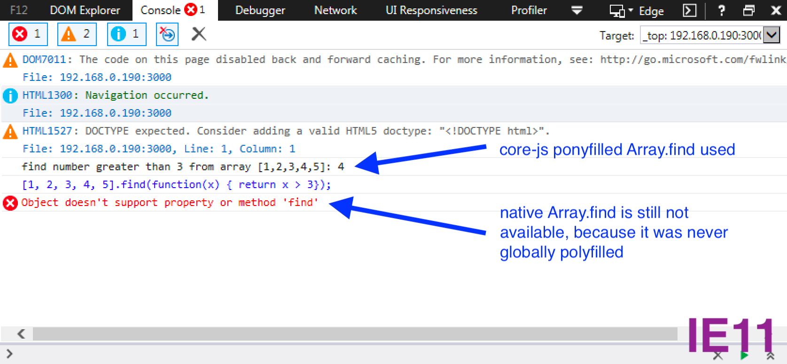

## parcel-babel-runtime-example

The goal of this PoC (proof of concept) is to setup working [`parcel-bundler`](https://github.com/parcel-bundler/parcel) environment where missing JS functionalities are patched by babel-runtime (aka. Ponyfills) instead of polyfilling global namespace.

### Why are polyfills bad?
Polyfilling means only patching functionalities that are missing, usually on older browsers, while using native implementations whenever it is available (modern browsers). The problem with polyfilling is it patches global objects, so for example if `Array.from(..)` method is missing on IE a polyfill will add a `form` method to `Array.prototype` object.

That means if there are two polyfilling solutions used on a single page only the first implementation will be used. This may (and actually did to me) lead to incompatible mix of polyfills.

The extra polyfills are usually introduced with 3rd party software like all kinds of analytics or ads providers.

### The solution
The solution is not to polyfill at all, but instead wrap missing functionalities in functions. No global patching takes place. Thats exactly the difference between `polyfills` and `ponyfills`.

So instead:

```js
[1, 2, 3, 4, 5].find(x => x > 3);
```

We want to write:

```js
find([1, 2, 3, 4, 5], (x) => x > 3);
```
Where `find` is a function providing same behaviour as that one in modern browsers `Array.find(...)`.


### Different syntaxes
We can see in an example above that, even though the goal of having a desired functionality while not patching global namespace is achieved, the syntax is clearly different.

To use exactly same syntax when coding, we use babel plugin to do the conversion. Babel is a transpiler and that's exactly what it is designed for.
The plugin we want to use is [`@babel/plugin-transform-runtime`](https://babeljs.io/docs/en/babel-plugin-transform-runtime).


### Patching library
The library we use is [`core-js`](https://github.com/zloirock/core-js). It provides both approaches: polyfiling (default) and ponyfilling (which they call "pure").

## Setup
Setup is actually extremely simple. What we need to do is
1) Add `@babel/plugin-transform-runtime` package:
```bash
yarn add --dev @babel/plugin-transform-runtime
```

2) Configure `.babelrc`:

```json
{
  "plugins": [
    ["@babel/plugin-transform-runtime", {
      "corejs": 3,
    }]
  ]
}

```

That's all that is needed to have fully working sandbox polyfilling (aka ponyfilling) solution integrated into parcel-based build pipeline.

## Demo
This demo transpiles:
```js
const array = [1, 2, 3, 4, 5];
const number = array.find((x) => x > 3);
console.log(`find number greater than 3 from array [${array}]: ${number}`);
```

into:
```js
//...

var array = [1, 2, 3, 4, 5];
var number = (0, _find.default)(array).call(array, function (x) {
  return x > 3;
});
console.log((0, _concat.default)(_context = "find number greater than 3 from array [".concat(array, "]: ")).call(_context, number));
//...
```
As we can see the native `Array.find` method is not used but `_find` method (coming from `core-js`) is used instead.

#### Screenshots:

Screenshot of demo running in IE11

---

Screenshot of demo running in Firefox

### To run the demo:

```bash
yarn install
yarn run serve
# go to http://localhost:3000/, and see dev console!
```